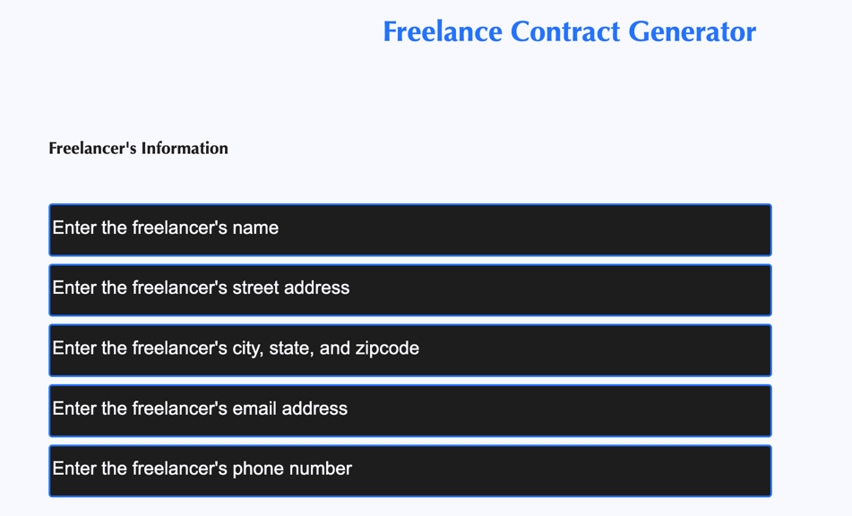
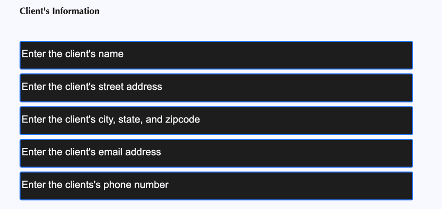
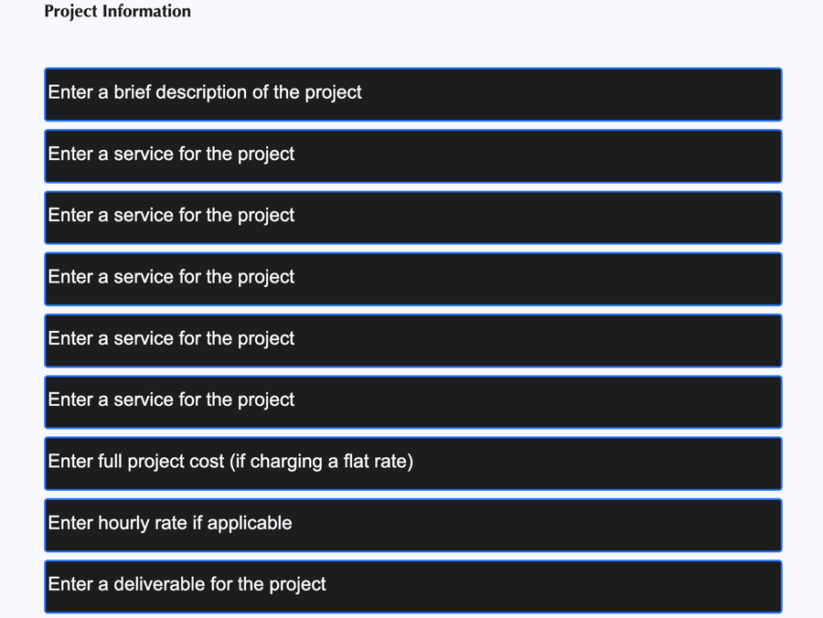
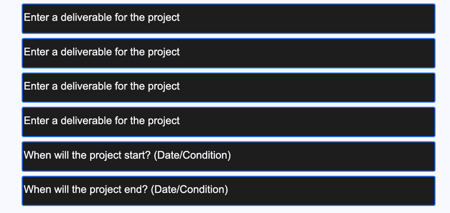
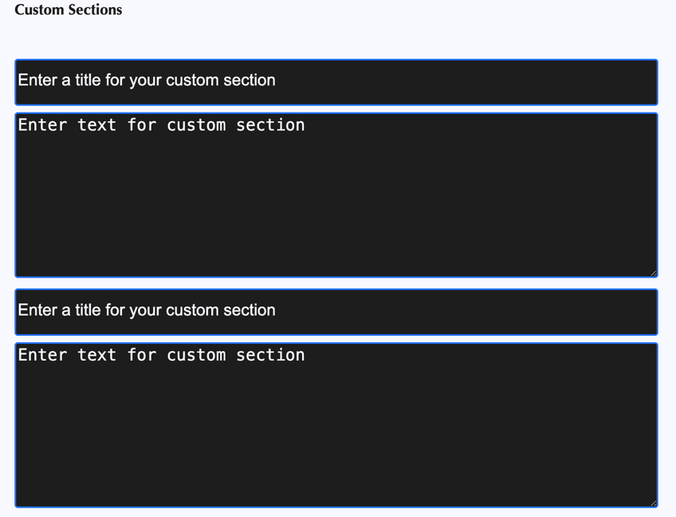
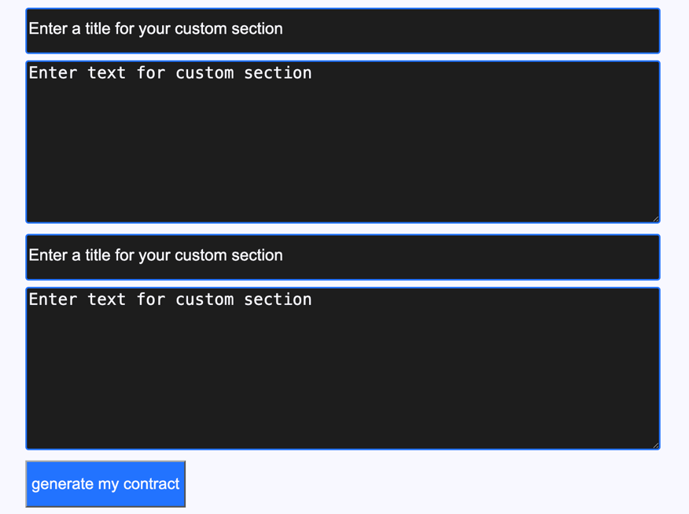

# Freelance Contract Generator
A web application that allows an end user to enter details about their freelance 
contract to generate a usable digital contract for their 
clients. 
# Business Impact
## The Problem
Freelancers need contracts that are easy to understand
and work to protect their interests and the interests
of their clients. But they can be complicated and 
time consuming, which often distracts freelancers from
doing what they do well: running their business.
## The Solution
The Freelance Contract Generator will take the guesswork
out of the equation by prompting the end user for the
project details and outputting a solid contract they 
can use, saving them hours of research and writing.
## Target User
This web application will be ideal for all freelancers;
however, it will be most useful for new freelancers who
want to build a quick and easy contract.
# Tech Stack
The current version utilizes the following technologies:

* WebStorm for development
* Chrome for testing and debugging
* HTML and for front-end interface
* JavaScript for MVP business logic
* GitHub for code and project repository
# Status
This project is currently in the development stage for
the minimum viable product (MVP). It is being developed
offline and is not currently deployed.
# MVP Version
The MVP version of the Freelance Contract Generator will
have the following features:

* The end user will enter details to customize their contract.
* The end user will generate the contract.
* The end user will export the contract to a Word file.
## Screenshots of the MVP
### Freelancer's Information

### Client's Information

### Project Information

### Custom Sections

# Plans for Full Version
The full version will have the following features:

* User login for freelancers and clients
* Saved contracts
* Digital signatures for freelancers and clients
* Project status feed accesible to members of project
* Project file links
* Client and freelance messaging
# Projected Timelines
* MVP deployment: November 1, 2026
* Full version deployment: February 1, 2027